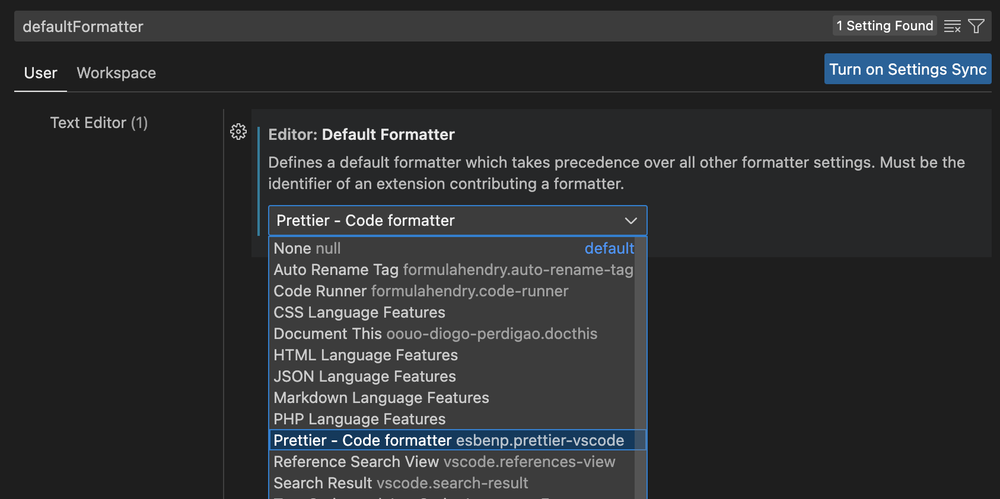
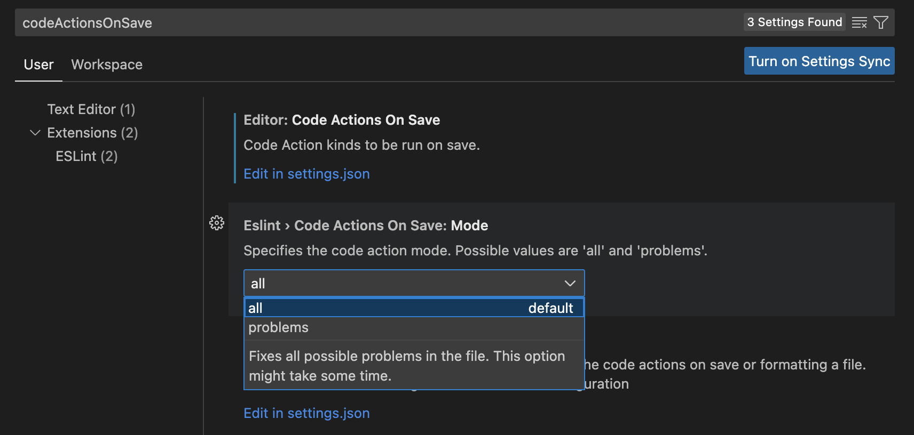

# eslint-config-airbnb-ts-pettier

This package provides a out of box ESLint config based on Airbnb's ESLint config with TypeScript and Prettier support.

## Install eslint-config-airbnb-ts-pettier

`yarn`

```sh
yarn add "eslint-config-airbnb-ts-pettier" -D
```

or `npm`

```sh
npm install "eslint-config-airbnb-ts-pettier" -D
```

or `pnpm`

```sh
pnpm install "eslint-config-airbnb-ts-pettier" -D
```

## Update your `ESLint` config

Add `"extends": "eslint-config-airbnb-ts-pettier"` to your `.eslintrc.*` file. Make sure to put it last, so it gets the chance to override other configs.

```json
{ "extends": ["eslint-config-airbnb-ts-pettier"] }
```

## VSCode

### 1. Install "Prettier - Code formatter" VSCode plugin

### 2. Set Prettier as Default Code formatter.

Go to the VSCode > Preference > Settings



### 3. Enable "Format On Save"



Then you will see these settings in your VSCode `settings.json`.

```json
  "editor.codeActionsOnSave": {
    "source.fixAll.eslint": true
  },
  "editor.defaultFormatter": "esbenp.prettier-vscode",
```

## Success
